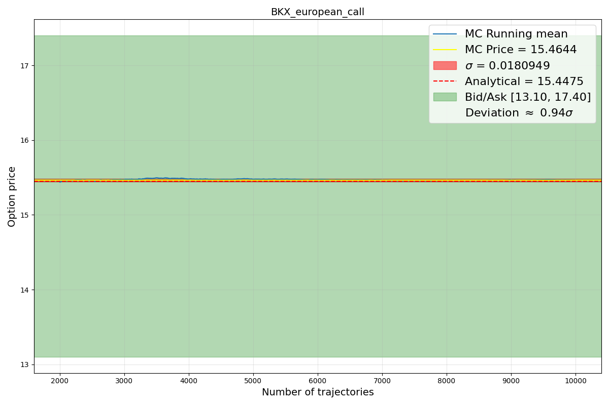
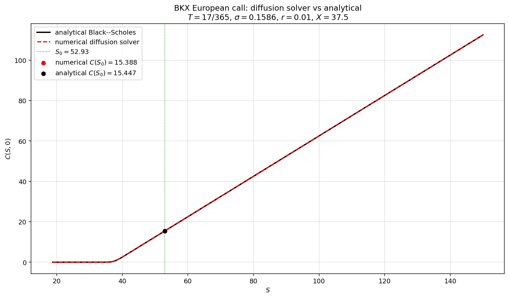

# From Brownian Paths to the Heat Equation

**Two Numerical Routes to Black--Scholes.** Project for the "Numerical Methods in Financial Physics" course. Prices European, Asian, binary and lookback options in two independent ways and compares them to the analytical Black--Scholes formulae:

1. **Monte Carlo** simulation of the Feynman--Kac representation, in C++.
2. **Diffusion-equation solver** obtained by reducing the Black--Scholes PDE to the heat equation and integrating it with a Strang-split operator exponential, in Python.

The full write-up with derivations, figures and references is in [`report/main.pdf`](report/main.pdf).

## Result at a glance

The same BKX European call, priced two ways:

<p align="center">
  
  
</p>

Left: Monte Carlo running mean converging into the quoted bid--ask band. Right: the diffusion-equation solver's price curve $C(S,0)$ overlaid on the analytical Black--Scholes curve (they overlap). Same option in both, S₀=52.93, X=37.5, σ=0.1586, T=17/365. Both methods agree with the analytical price to well within the market bid--ask spread.

## Layout

```
report/          LaTeX source + compiled PDF + plots
monte_carlo/     C++ Monte Carlo simulation
  main.cpp       driver, reads params.csv
  MonteCarlo.cpp BlackScholes class, payoff functions
  options/       CSV specifications of each option to price
  data/          raw market data (BKX / DJX quotes)
  results/       CSVs of running-mean output
  plots/         MC running-mean figures
  plot_running_mean.py
diffusion/       Python diffusion-equation solver
  diffusion.py       minimal implementation
  diffusion_3d.py    same solver + 3D surface / slice / error plots
```

## Running it

**Monte Carlo (C++17)**

```bash
cd monte_carlo
g++ -O2 -std=c++17 main.cpp -o mc
./mc
python3 plot_running_mean.py
```

**Diffusion (Python 3)**

```bash
cd diffusion
python3 diffusion.py        # BKX call, 2D plot
python3 diffusion_3d.py     # BKX + T=1 benchmark, 3D surfaces and slices
```

Requires `numpy`, `scipy`, `matplotlib`.

## Options implemented

| Option        | MC | Diffusion | Analytical baseline    |
|---------------|:--:|:---------:|------------------------|
| European call | ✓  | ✓         | Black--Scholes         |
| European put  | ✓  |           | Black--Scholes         |
| Asian call    | ✓  |           | Kemna--Vorst approx.   |
| Asian put     | ✓  |           | Kemna--Vorst approx.   |
| Binary call   | ✓  |           | Black--Scholes digital |
| Binary put    | ✓  |           | Black--Scholes digital |
| Lookback call | ✓  |           | Goldman--Sosin--Gatto  |
| Lookback put  | ✓  |           | Goldman--Sosin--Gatto  |

## AI usage

Claude Opus (Anthropic) was used to (i) refine the writing style of the report, (ii) resolve a numerical issue in the diffusion-equation solver where the discretised time step in the Strang splitting was mis-scaled, and (iii) generate the 3D comparison plots. The physics, derivations, Monte Carlo implementation and analytical formulae are my own. + It wrote this README!

## Author

Dorian Przetakiewicz, 2026.
